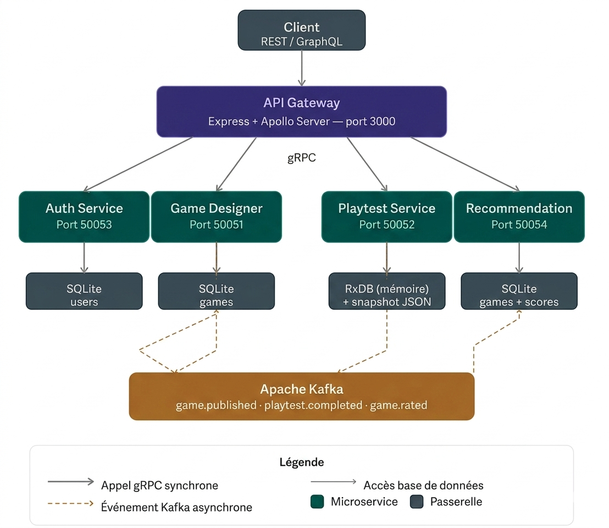

<div align="center">

#  Board Game Forge

**Plateforme collaborative de conception, test et recommandation de jeux de plateau**

*Architecture microservices · gRPC · Kafka · GraphQL · REST · JWT*

[](https://nodejs.org)
[](https://kafka.apache.org)
[](https://grpc.io)
[](https://www.apollographql.com)
[](https://www.sqlite.org)
[](LICENSE)

---

> Conçu par **Emna Zaoui** — 4ème année GL1  
> Cours : *Architecture Orientée Service* — Salah Gontara

</div>

---

##  Table des matières

- [Vue d'ensemble](#-vue-densemble)
- [Architecture](#-architecture)
- [Stack technique](#-stack-technique)
- [Structure du projet](#-structure-du-projet)
- [Microservices](#-microservices)
- [API Gateway](#-api-gateway)
- [Topics Kafka](#-topics-kafka)
- [Bases de données](#-bases-de-données)
- [Prérequis](#-prérequis)
- [Installation & démarrage](#-installation--démarrage)
- [Tests avec Postman — API REST](#-tests-avec-postman--api-rest)
- [API GraphQL](#-api-graphql)
- [Variables d'environnement](#-variables-denvironnement)
- [Flux de données](#-flux-de-données)
- [Dépannage](#-dépannage)

---

##  Vue d'ensemble

**Board Game Forge** est une plateforme microservices permettant à des créateurs de **concevoir des jeux de plateau**, de les soumettre à des **sessions de playtest**, et d'obtenir des **recommandations personnalisées** basées sur les historiques de jeu.

### Fonctionnalités principales

| Fonctionnalité | Description |
|---|---|
| 👤 **Authentification** | Inscription, connexion, tokens JWT (24h), hachage bcrypt |
| 🎮 **Gestion des jeux** | CRUD complet : créer, lire, modifier, supprimer des jeux |
| 🧪 **Playtest** | Sessions de test avec soumission de mouvements et score final |
|  **Recommandations** | Algorithme 3 niveaux : collaboratif → meilleure note → fallback |
| 📡 **Événements** | Communication asynchrone inter-services via Apache Kafka |
| 🔗 **Double API** | REST (Express) et GraphQL (Apollo Server) sur le même gateway |

---

## 🏗️ Architecture

Le système repose sur un **API Gateway** central qui reçoit toutes les requêtes client et les distribue aux microservices via **gRPC**. Les services communiquent entre eux de façon asynchrone via **Apache Kafka**.



> *Chaque microservice possède sa propre base de données. Les événements métier transitent par Kafka sans couplage direct entre les services.*

### Principes de conception

- **Isolation complète** — chaque service a son propre processus, sa propre base et son propre contrat `.proto`
- **Communication synchrone** — gRPC (HTTP/2 + Protobuf) pour les appels directs gateway → services
- **Communication asynchrone** — Kafka pour les événements métier inter-services
- **Point d'entrée unique** — le gateway centralise auth, routage REST et GraphQL
- **Résilience** — le playtest-service persiste ses données via snapshot JSON au redémarrage

---

## 🛠️ Stack technique

| Couche | Technologie | Version | Rôle |
|---|---|---|---|
| Runtime | Node.js | 18+ LTS | Tous les services |
| Communication interne | gRPC (`@grpc/grpc-js`) | ^1.9.12 | Appels synchrones entre gateway et services |
| Sérialisation | Protocol Buffers (proto3) | — | Contrats d'interface des services |
| Bus d'événements | Apache Kafka (`kafkajs`) | ^2.2.4 | Événements asynchrones inter-services |
| API REST | Express.js | ^4.18.2 | Exposition REST dans le gateway |
| API GraphQL | Apollo Server 4 + GraphQL | ^4.9.5 | Exposition GraphQL dans le gateway |
| Auth | JWT (`jsonwebtoken`) | ^9.0.2 | Tokens d'accès signés 24h |
| Hachage | bcrypt | ^5.1.1 | Mots de passe utilisateurs |
| Base relationnelle | SQLite3 | ^5.1.6 | Auth, Game Designer, Recommendation |
| Base réactive | RxDB + storage mémoire | ^16.21.1 | Sessions de playtest |
| Validation schéma | RxDB AJV plugin | — | Validation documents RxDB |
| Config | dotenv | ^16.3.1 | Variables d'environnement |

---

## 📁 Structure du projet
board-game-forge/
│
├── api-gateway/                    # Port 3000 — Point d'entrée unique
│   ├── apiGateway.js               # Serveur Express + Apollo, clients gRPC, routes REST
│   ├── resolvers.js                # Résolveurs GraphQL (Query + Mutation)
│   ├── schema.gql                  # Schéma GraphQL complet
│   ├── auth.proto                  # Copie locale du contrat Auth
│   ├── gameDesigner.proto          # Copie locale du contrat Game Designer
│   ├── playtest.proto              # Copie locale du contrat Playtest
│   ├── recommendation.proto        # Copie locale du contrat Recommendation
│   ├── package.json
│   └── .env
│
├── auth-service/                   # Port 50053 — gRPC
│   ├── authMicroservice.js         # Logique Register / Login / VerifyToken
│   ├── auth.proto                  # Contrat gRPC du service
│   ├── package.json
│   └── .env
│
├── game-designer-service/          # Port 50051 — gRPC + Kafka producer/consumer
│   ├── gameDesignerMicroservice.js # CRUD jeux + publication game.published
│   ├── gameDesigner.proto          # Contrat gRPC du service
│   ├── package.json
│   └── .env
│
├── playtest-service/               # Port 50052 — gRPC + Kafka producer
│   ├── playtestMicroservice.js     # Gestion sessions de test
│   ├── db.js                       # Init RxDB in-memory + snapshot JSON
│   ├── playtest.proto              # Contrat gRPC du service
│   ├── data/                       # Snapshot JSON (auto-créé)
│   │   └── playtests.snapshot.json
│   ├── package.json
│   └── .env
│
├── recommendation-service/         # Port 50054 — gRPC + Kafka consumer/producer
│   ├── recommendationMicroservice.js # Algorithme recommandation 3 niveaux
│   ├── recommendation.proto        # Contrat gRPC du service
│   ├── package.json
│   └── .env
│
├── create-topics.js                # Script de création des 3 topics Kafka
├── .gitignore
└── README.md
---

## 🔧 Microservices

### Auth Service — Port `50053`

Gère le cycle de vie des comptes utilisateurs.

| Méthode gRPC | Description | Auth requise |
|---|---|---|
| `Register` | Crée un utilisateur (bcrypt hash, 10 rounds) | Non |
| `Login` | Vérifie les identifiants, retourne un JWT 24h | Non |
| `VerifyToken` | Valide et décode un JWT | Non |

**Base de données** : SQLite — table `users` (`id`, `username`, `password_hash`, `email`)

---

### Game Designer Service — Port `50051`

CRUD complet sur les jeux. Maintient la note moyenne via Kafka.

| Méthode gRPC | Description |
|---|---|
| `CreateGame` | Crée un jeu + publie `game.published` sur Kafka si catégories présentes |
| `GetGame` | Récupère un jeu par ID |
| `UpdateGame` | Modifie nom, description, règles, catégories |
| `DeleteGame` | Supprime un jeu |
| `ListGames` | Retourne tous les jeux |
| `UpdateRating` | Met à jour la note (appelé via Kafka `game.rated`) |

**Kafka producer** → topic `game.published`  
**Kafka consumer** → topic `game.rated` (groupe `game-designer-group`)  
**Base de données** : SQLite — table `games`

---

### Playtest Service — Port `50052`

Gère les sessions de test de jeu avec persistance RxDB.

| Méthode gRPC | Description |
|---|---|
| `StartPlaytest` | Crée une session `in_progress` avec moves vides |
| `SubmitMove` | Ajoute un mouvement JSON à la session, persiste le snapshot |
| `GetPlaytestStatus` | Retourne l'état courant d'une session |
| `CompletePlaytest` | Clôture la session avec score, publie `playtest.completed` sur Kafka |

**Kafka producer** → topic `playtest.completed`  
**Base de données** : RxDB in-memory + `data/playtests.snapshot.json`

> 💡 Le snapshot JSON est rechargé automatiquement au redémarrage du service.

---

### Recommendation Service — Port `50054`

Calcule les recommandations personnalisées via un algorithme à 3 niveaux.

| Méthode gRPC | Description |
|---|---|
| `GetRecommendations` | Retourne jusqu'à `limit` jeux recommandés pour un `userId` |

**Algorithme de recommandation :**
Niveau 1 — Filtrage collaboratif
→ Joueurs ayant joué les mêmes jeux → leurs autres jeux recommandés
→ Retourné si ≥ 3 résultats
Niveau 2 — Meilleure note non jouée
→ Jeux non testés par l'utilisateur, triés par score moyen DESC
→ Retourné si ≥ 1 résultat
Niveau 3 — Fallback total
→ Tous les jeux disponibles, score 0
→ Toujours retourné en dernier recours

**Kafka consumers** (groupe `rec-service-group`) :
- `game.published` → indexe le jeu dans la table locale `games`
- `playtest.completed` → enregistre le score, calcule la moyenne, publie `game.rated`

**Kafka producer** → topic `game.rated`  
**Base de données** : SQLite — tables `games` + `playtest_scores`

---

## 🌐 API Gateway — Port `3000`

Point d'entrée unique du système. Expose REST et GraphQL, vérifie le JWT via gRPC à chaque requête.

### Middleware d'authentification
Requête HTTP entrante
└── Header: Authorization: Bearer <token>
└── authClient.VerifyToken() via gRPC
├── valide → req.user = { userId, username }
└── invalide → req.user = undefined (routes protégées → 401)
---

## 📡 Topics Kafka

| Topic | Producteur | Consommateur | Déclencheur |
|---|---|---|---|
| `game.published` | game-designer | recommendation | `CreateGame` avec catégories |
| `playtest.completed` | playtest | recommendation | `CompletePlaytest` |
| `game.rated` | recommendation | game-designer | Après calcul de moyenne |

### Flux complet
CreateGame()
└─► [game.published] ─► Recommendation indexe le jeu
CompletePlaytest()
└─► [playtest.completed] ─► Recommendation enregistre le score
└─► calcule AVG(score)
└─► [game.rated] ─► GameDesigner met à jour averageRating
---

## 🗄️ Bases de données

| Service | Technologie | Table(s) | Remarque |
|---|---|---|---|
| auth-service | SQLite | `users` | Mots de passe hachés bcrypt |
| game-designer-service | SQLite | `games` | `categories` stocké en JSON string |
| recommendation-service | SQLite | `games`, `playtest_scores` | Données répliquées via Kafka |
| playtest-service | RxDB in-memory | collection `playtests` | Persisté via snapshot JSON |

---

##  Prérequis

Avant de commencer, assurez-vous d'avoir installé :

- **Node.js** 18 ou 20 LTS → [nodejs.org](https://nodejs.org)
- **Java 17+** (requis par Kafka) → [adoptium.net](https://adoptium.net)
- **Apache Kafka 4.2** en mode **KRaft** (sans Zookeeper) décompressé dans `C:\kafka`
  → [kafka.apache.org/downloads](https://kafka.apache.org/downloads)

> ⚠️ Kafka 4.2 fonctionne en mode KRaft — Zookeeper n'est plus nécessaire.

---

##  Installation & démarrage

### Étape 1 — Démarrer Kafka (PowerShell dans `C:\kafka`)

```powershell
# Générer un UUID de cluster
$id = (.\bin\windows\kafka-storage.bat random-uuid | Select-Object -Last 1)

# Formater le storage en mode standalone KRaft
.\bin\windows\kafka-storage.bat format --standalone -t $id -c .\config\server.properties

# Démarrer le broker Kafka
.\bin\windows\kafka-server-start.bat .\config\server.properties
```

> Kafka doit rester **en cours d'exécution** dans ce terminal pendant toute la session.

---

### Étape 2 — Créer les topics Kafka

Depuis la **racine du projet** (`board-game-forge/`) :

```bash
node create-topics.js
```

Ou manuellement depuis `C:\kafka` :

```powershell
.\bin\windows\kafka-topics.bat --create --topic game.published --bootstrap-server localhost:9092 --partitions 1 --replication-factor 1

.\bin\windows\kafka-topics.bat --create --topic playtest.completed --bootstrap-server localhost:9092 --partitions 1 --replication-factor 1

.\bin\windows\kafka-topics.bat --create --topic game.rated --bootstrap-server localhost:9092 --partitions 1 --replication-factor 1
```

Vérifier que les topics sont créés :

```powershell
.\bin\windows\kafka-topics.bat --list --bootstrap-server localhost:9092
```

---

### Étape 3 — Lancer les microservices (4 terminaux séparés)

> Chaque service doit tourner dans son propre terminal. L'ordre ci-dessous est recommandé.

**Terminal 1 — Auth Service**
```bash
cd auth-service
npm install
node authMicroservice.js
# Auth service on port 50053
```

**Terminal 2 — Game Designer Service**
```bash
cd game-designer-service
npm install
node gameDesignerMicroservice.js
# GameDesigner service on port 50051
```

**Terminal 3 — Playtest Service**
```bash
cd playtest-service
npm install
node playtestMicroservice.js
# Playtest service on port 50052
```

**Terminal 4 — Recommendation Service**
```bash
cd recommendation-service
npm install
node recommendationMicroservice.js
#  Recommendation service on port 50054
```

---

### Étape 4 — Lancer l'API Gateway

**Terminal 5 — API Gateway**
```bash
cd api-gateway
npm install
node apiGateway.js
#  API Gateway running on http://localhost:3000
```

---

### Récapitulatif des ports

| Service | Port | Protocole |
|---|---|---|
| API Gateway | `3000` | HTTP (REST + GraphQL) |
| Auth Service | `50053` | gRPC |
| Game Designer Service | `50051` | gRPC |
| Playtest Service | `50052` | gRPC |
| Recommendation Service | `50054` | gRPC |
| Kafka Broker | `9092` | TCP |

---

##  Tests avec Postman — API REST

> **Base URL** : `http://localhost:3000`  
> **Header pour routes protégées** : `Authorization: Bearer <votre_token>`

---

### 👤 Authentification

**Inscription**
POST /api/auth/register
Content-Type: application/json
{
"username": "emna.zaoui",
"password": "emna123",
"email": "emna.zaoui@polytechnicien.tn"
}
Réponse :
```json
{
  "success": true,
  "message": "User created",
  "userId": "1716000000000-abc123"
}
```

---

**Connexion** *(récupérer le token pour les requêtes suivantes)*
POST /api/auth/login
Content-Type: application/json
{
"username": "emna.zaoui",
"password": "emna123"
}
Réponse :
```json
{
  "success": true,
  "token": "eyJhbGciOiJIUzI1NiIsInR5cCI6IkpXVCJ9...",
  "message": "Logged in",
  "userId": "1716000000000-abc123"
}
```

>  **Copiez le token** — il sera nécessaire pour toutes les routes protégées 🔐

---

### 🎮 Jeux

**Lister tous les jeux** *(public)*
GET /api/games
---

**Détail d'un jeu** *(public)*
GET /api/games/:id
---

**Créer un jeu** 
POST /api/games
Authorization: Bearer <token>
Content-Type: application/json
{
"name": "Chess Evolved",
"description": "Une réinvention moderne du jeu d'échecs",
"rules": "Chaque joueur dispose de 16 pièces. Le but est de mettre le roi adverse en échec et mat.",
"categories": ["Stratégie", "2 joueurs", "Classique"]
}
Réponse :
```json
{
  "id": "1716050000000-def456",
  "name": "Chess Evolved",
  "description": "Une réinvention moderne du jeu d'échecs",
  "rules": "Chaque joueur dispose de 16 pièces...",
  "creatorId": "1716000000000-abc123",
  "averageRating": 0,
  "categories": ["Stratégie", "2 joueurs", "Classique"],
  "createdAt": "2026-05-17T11:00:00.000Z"
}
```

> 💡 La création déclenche automatiquement la publication de `game.published` sur Kafka.

---

**Modifier un jeu** 
PUT /api/games/:id
Authorization: Bearer <token>
Content-Type: application/json
{
"name": "Chess Evolved v2",
"description": "Version améliorée",
"rules": "Nouvelles règles...",
"categories": ["Stratégie", "2 joueurs"]
}
---

**Supprimer un jeu** 
DELETE /api/games/:id
Authorization: Bearer <token>
---

###  Playtest

**Démarrer une session** 
POST /api/playtest/start
Authorization: Bearer <token>
Content-Type: application/json
{
"gameId": "1716050000000-def456"
}
Réponse :
```json
{
  "id": "550e8400-e29b-41d4-a716-446655440000",
  "gameId": "1716050000000-def456",
  "userId": "1716000000000-abc123",
  "state": "in_progress",
  "moves": "[]",
  "startedAt": "2026-05-17T11:15:00.000Z",
  "completedAt": "",
  "score": 0
}
```

---

**Soumettre un mouvement** 
POST /api/playtest/:sessionId/move
Authorization: Bearer <token>
Content-Type: application/json
{
"moveJson": "{"action": "move", "piece": "pawn", "from": "e2", "to": "e4", "turn": 1}"
}
---

**Terminer la session** 
POST /api/playtest/:sessionId/complete
Authorization: Bearer <token>
Content-Type: application/json
{
"score": 850
}
> 💡 Déclenche la chaîne : `playtest.completed` → calcul de moyenne → `game.rated` → mise à jour `averageRating`.

---

###  Recommandations

**Obtenir des recommandations** *(public)*
GET /api/recommendations/:userId
Réponse :
```json
[
  { "gameId": "1716050000000-def456", "name": "Chess Evolved", "score": 8.5 },
  { "gameId": "1716060000000-ghi789", "name": "Hex Wars", "score": 7.2 }
]
```

---

### Tableau récapitulatif

| Opération | Méthode | URL | Auth |
|---|---|---|---|
| Inscription | `POST` | `/api/auth/register` | Non |
| Connexion | `POST` | `/api/auth/login` | Non |
| Lister les jeux | `GET` | `/api/games` | Non |
| Détail d'un jeu | `GET` | `/api/games/:id` | Non |
| Créer un jeu | `POST` | `/api/games` | 🔐 |
| Modifier un jeu | `PUT` | `/api/games/:id` | 🔐 |
| Supprimer un jeu | `DELETE` | `/api/games/:id` | 🔐 |
| Démarrer playtest | `POST` | `/api/playtest/start` | 🔐 |
| Soumettre un mouvement | `POST` | `/api/playtest/:id/move` | 🔐 |
| Terminer playtest | `POST` | `/api/playtest/:id/complete` | 🔐 |
| Recommandations | `GET` | `/api/recommendations/:userId` | Non |

---

## 🔷 API GraphQL

**Endpoint** : `POST http://localhost:3000/graphql`  
**Interface** : Apollo Sandbox disponible sur `http://localhost:3000/graphql` dans le navigateur

---

### Queries

```graphql
# Lister tous les jeux
query {
  games {
    id
    name
    averageRating
    categories
    createdAt
  }
}

# Détail d'un jeu
query {
  game(id: "1716050000000-def456") {
    id
    name
    description
    rules
    creatorId
    averageRating
  }
}

# Statut d'une session de playtest
query {
  playtestStatus(sessionId: "550e8400-e29b-41d4-a716-446655440000") {
    id
    state
    moves
    score
    completedAt
  }
}

# Recommandations
query {
  recommendations(userId: "1716000000000-abc123", limit: 5) {
    gameId
    name
    score
  }
}
```

---

### Mutations

```graphql
# Inscription
mutation {
  register(
    username: "emna.zaoui"
    password: "emna123"
    email: "emna.zaoui@polytechnicien.tn"
  ) {
    success
    message
    userId
  }
}

# Connexion
mutation {
  login(username: "emna.zaoui", password: "emna123") {
    success
    token
    userId
  }
}

# Créer un jeu (token requis dans le header HTTP)
# Header: Authorization: Bearer <token>
mutation {
  createGame(
    name: "Chess Evolved"
    description: "Une réinvention du jeu d'échecs"
    rules: "Chaque joueur dispose de 16 pièces..."
    categories: ["Stratégie", "2 joueurs"]
  ) {
    id
    name
    creatorId
    createdAt
  }
}

# Démarrer un playtest
mutation {
  startPlaytest(gameId: "1716050000000-def456") {
    id
    state
    startedAt
  }
}

# Soumettre un mouvement
mutation {
  submitMove(
    sessionId: "550e8400-e29b-41d4-a716-446655440000"
    moveJson: "{\"action\": \"move\", \"piece\": \"pawn\", \"from\": \"e2\", \"to\": \"e4\"}"
  ) {
    success
    newState
  }
}

# Terminer un playtest
mutation {
  completePlaytest(
    sessionId: "550e8400-e29b-41d4-a716-446655440000"
    score: 850
  ) {
    success
  }
}
```
---
## 📨 Contrats gRPC — Référence complète des services

> Les microservices communiquent exclusivement via **gRPC** (Protocol Buffers proto3).
> Le gateway instancie un client gRPC par service et appelle leurs méthodes directement.
> Les fichiers `.proto` définissent le contrat strict de chaque service.

---

### 🔐 Auth Service — `auth.proto` — Port `50053`

```protobuf
syntax = "proto3";
package auth;

service AuthService {
  rpc Register(RegisterRequest)     returns (RegisterResponse);
  rpc Login(LoginRequest)           returns (LoginResponse);
  rpc VerifyToken(VerifyTokenRequest) returns (VerifyTokenResponse);
}
```

---

#### `Register` — Créer un compte utilisateur

**Request** `RegisterRequest` :

| Champ | Type | Description |
|---|---|---|
| `username` | string | Nom d'utilisateur unique |
| `password` | string | Mot de passe en clair (haché côté service) |
| `email` | string | Adresse email |

**Response** `RegisterResponse` :

| Champ | Type | Description |
|---|---|---|
| `success` | bool | `true` si l'inscription a réussi |
| `message` | string | `"User created"` ou message d'erreur |
| `userId` | string | ID généré pour le nouvel utilisateur |

**Exemple d'appel gRPC (grpcurl)** :
```bash
grpcurl -plaintext -d '{
  "username": "emna.zaoui",
  "password": "emna123",
  "email": "emna.zaoui@polytechnicien.tn"
}' localhost:50053 auth.AuthService/Register
```

**Réponse** :
```json
{
  "success": true,
  "message": "User created",
  "userId": "1716000000000-abc123"
}
```

**Erreurs gRPC** :

| Code | Condition |
|---|---|
| `ALREADY_EXISTS` | Le `username` est déjà utilisé |
| `INTERNAL` | Erreur bcrypt ou SQLite |

---

#### `Login` — Authentifier un utilisateur

**Request** `LoginRequest` :

| Champ | Type | Description |
|---|---|---|
| `username` | string | Nom d'utilisateur |
| `password` | string | Mot de passe en clair |

**Response** `LoginResponse` :

| Champ | Type | Description |
|---|---|---|
| `success` | bool | `true` si les identifiants sont valides |
| `token` | string | JWT signé, valable 24h, contenant `{ userId, username }` |
| `message` | string | `"Logged in"` |
| `userId` | string | ID de l'utilisateur |

**Exemple d'appel gRPC** :
```bash
grpcurl -plaintext -d '{
  "username": "emna.zaoui",
  "password": "emna123"
}' localhost:50053 auth.AuthService/Login
```

**Réponse** :
```json
{
  "success": true,
  "token": "eyJhbGciOiJIUzI1NiIsInR5cCI6IkpXVCJ9...",
  "message": "Logged in",
  "userId": "1716000000000-abc123"
}
```

**Erreurs gRPC** :

| Code | Condition |
|---|---|
| `NOT_FOUND` | Utilisateur inexistant |
| `UNAUTHENTICATED` | Mot de passe incorrect |

---

#### `VerifyToken` — Valider un JWT

**Request** `VerifyTokenRequest` :

| Champ | Type | Description |
|---|---|---|
| `token` | string | JWT à vérifier |

**Response** `VerifyTokenResponse` :

| Champ | Type | Description |
|---|---|---|
| `valid` | bool | `true` si le token est valide et non expiré |
| `userId` | string | ID extrait du token (si valide) |
| `username` | string | Username extrait du token (si valide) |

**Exemple d'appel gRPC** :
```bash
grpcurl -plaintext -d '{
  "token": "eyJhbGciOiJIUzI1NiIsInR5cCI6IkpXVCJ9..."
}' localhost:50053 auth.AuthService/VerifyToken
```

**Réponse (token valide)** :
```json
{
  "valid": true,
  "userId": "1716000000000-abc123",
  "username": "emna.zaoui"
}
```

**Réponse (token invalide ou expiré)** :
```json
{
  "valid": false
}
```

> 💡 Cette méthode est appelée automatiquement par le gateway à chaque requête HTTP
> portant un header `Authorization: Bearer <token>`. Elle n'est jamais exposée directement au client.

---

### 🎮 Game Designer Service — `gameDesigner.proto` — Port `50051`

```protobuf
syntax = "proto3";
package gamedesigner;

service GameDesignerService {
  rpc CreateGame(CreateGameRequest)   returns (CreateGameResponse);
  rpc GetGame(GetGameRequest)         returns (GetGameResponse);
  rpc UpdateGame(UpdateGameRequest)   returns (UpdateGameResponse);
  rpc DeleteGame(DeleteGameRequest)   returns (DeleteGameResponse);
  rpc ListGames(ListGamesRequest)     returns (ListGamesResponse);
  rpc UpdateRating(UpdateRatingRequest) returns (UpdateRatingResponse);
}
```

**Type `Game`** (utilisé dans plusieurs réponses) :

| Champ | Type | Description |
|---|---|---|
| `id` | string | Identifiant unique |
| `name` | string | Nom du jeu |
| `description` | string | Description courte |
| `rules` | string | Règles complètes |
| `creatorId` | string | ID du créateur |
| `averageRating` | double | Moyenne des scores (mis à jour via Kafka) |
| `categories` | repeated string | Liste des catégories |
| `createdAt` | string | Date ISO 8601 |

---

#### `CreateGame` — Créer un jeu

**Request** `CreateGameRequest` :

| Champ | Type | Description |
|---|---|---|
| `name` | string | Nom du jeu |
| `description` | string | Description |
| `rules` | string | Règles |
| `creatorId` | string | ID du créateur (injecté depuis le JWT) |
| `categories` | repeated string | Catégories (ex: `["Stratégie","2 joueurs"]`) |

**Response** `CreateGameResponse` :

| Champ | Type | Description |
|---|---|---|
| `game` | Game | Objet jeu complet créé |

**Exemple d'appel gRPC** :
```bash
grpcurl -plaintext -d '{
  "name": "Chess Evolved",
  "description": "Une réinvention du jeu d échecs",
  "rules": "Chaque joueur dispose de 16 pièces...",
  "creatorId": "1716000000000-abc123",
  "categories": ["Stratégie", "2 joueurs", "Classique"]
}' localhost:50051 gamedesigner.GameDesignerService/CreateGame
```

**Réponse** :
```json
{
  "game": {
    "id": "1716050000000-def456",
    "name": "Chess Evolved",
    "description": "Une réinvention du jeu d échecs",
    "rules": "Chaque joueur dispose de 16 pièces...",
    "creatorId": "1716000000000-abc123",
    "averageRating": 0,
    "categories": ["Stratégie", "2 joueurs", "Classique"],
    "createdAt": "2026-05-17T11:00:00.000Z"
  }
}
```

> 💡 Si `categories` n'est pas vide, l'événement `game.published` est publié sur Kafka.

**Erreurs gRPC** :

| Code | Condition |
|---|---|
| `INTERNAL` | Erreur SQLite à l'insertion |

---

#### `GetGame` — Récupérer un jeu

**Request** `GetGameRequest` :

| Champ | Type | Description |
|---|---|---|
| `gameId` | string | ID du jeu à récupérer |

**Response** `GetGameResponse` :

| Champ | Type | Description |
|---|---|---|
| `game` | Game | Objet jeu complet |

**Exemple d'appel gRPC** :
```bash
grpcurl -plaintext -d '{
  "gameId": "1716050000000-def456"
}' localhost:50051 gamedesigner.GameDesignerService/GetGame
```

**Erreurs gRPC** :

| Code | Condition |
|---|---|
| `NOT_FOUND` | Aucun jeu avec cet ID |

---

#### `UpdateGame` — Modifier un jeu

**Request** `UpdateGameRequest` :

| Champ | Type | Description |
|---|---|---|
| `gameId` | string | ID du jeu à modifier |
| `name` | string | Nouveau nom |
| `description` | string | Nouvelle description |
| `rules` | string | Nouvelles règles |
| `categories` | repeated string | Nouvelles catégories |

**Response** `UpdateGameResponse` :

| Champ | Type | Description |
|---|---|---|
| `success` | bool | `true` si la modification a réussi |

**Exemple d'appel gRPC** :
```bash
grpcurl -plaintext -d '{
  "gameId": "1716050000000-def456",
  "name": "Chess Evolved v2",
  "description": "Version améliorée",
  "rules": "Nouvelles règles...",
  "categories": ["Stratégie", "2 joueurs", "Compétitif"]
}' localhost:50051 gamedesigner.GameDesignerService/UpdateGame
```

**Erreurs gRPC** :

| Code | Condition |
|---|---|
| `INTERNAL` | Erreur SQLite à la mise à jour |

---

#### `DeleteGame` — Supprimer un jeu

**Request** `DeleteGameRequest` :

| Champ | Type | Description |
|---|---|---|
| `gameId` | string | ID du jeu à supprimer |

**Response** `DeleteGameResponse` :

| Champ | Type | Description |
|---|---|---|
| `success` | bool | `true` si la suppression a réussi |

**Exemple d'appel gRPC** :
```bash
grpcurl -plaintext -d '{
  "gameId": "1716050000000-def456"
}' localhost:50051 gamedesigner.GameDesignerService/DeleteGame
```

---

#### `ListGames` — Lister tous les jeux

**Request** `ListGamesRequest` : *(vide)*

**Response** `ListGamesResponse` :

| Champ | Type | Description |
|---|---|---|
| `games` | repeated Game | Liste de tous les jeux |

**Exemple d'appel gRPC** :
```bash
grpcurl -plaintext -d '{}' localhost:50051 gamedesigner.GameDesignerService/ListGames
```

---

#### `UpdateRating` — Mettre à jour la note moyenne

> ⚠️ Cette méthode est **réservée à l'usage interne**. Elle est appelée uniquement
> par le consumer Kafka `game.rated` du service lui-même — jamais exposée au client.

**Request** `UpdateRatingRequest` :

| Champ | Type | Description |
|---|---|---|
| `gameId` | string | ID du jeu |
| `newAverage` | double | Nouvelle note moyenne calculée |

**Response** `UpdateRatingResponse` :

| Champ | Type | Description |
|---|---|---|
| `success` | bool | `true` si la mise à jour a réussi |

---

### 🧪 Playtest Service — `playtest.proto` — Port `50052`

```protobuf
syntax = "proto3";
package playtest;

service PlaytestService {
  rpc StartPlaytest(StartPlaytestRequest)       returns (StartPlaytestResponse);
  rpc SubmitMove(SubmitMoveRequest)             returns (SubmitMoveResponse);
  rpc GetPlaytestStatus(GetPlaytestStatusRequest) returns (GetPlaytestStatusResponse);
  rpc CompletePlaytest(CompletePlaytestRequest) returns (CompletePlaytestResponse);
}
```

**Type `PlaytestSession`** :

| Champ | Type | Description |
|---|---|---|
| `id` | string | UUID v4 de la session |
| `gameId` | string | ID du jeu testé |
| `userId` | string | ID du testeur |
| `state` | string | `"in_progress"` ou `"completed"` |
| `moves` | string | JSON sérialisé des mouvements |
| `startedAt` | string | ISO 8601 |
| `completedAt` | string | ISO 8601 (vide si en cours) |
| `score` | int32 | Score final (0 si en cours) |

---

#### `StartPlaytest` — Démarrer une session

**Request** `StartPlaytestRequest` :

| Champ | Type | Description |
|---|---|---|
| `gameId` | string | ID du jeu à tester |
| `userId` | string | ID du joueur (injecté depuis le JWT) |

**Response** `StartPlaytestResponse` :

| Champ | Type | Description |
|---|---|---|
| `session` | PlaytestSession | Session créée avec `state: "in_progress"` |

**Exemple d'appel gRPC** :
```bash
grpcurl -plaintext -d '{
  "gameId": "1716050000000-def456",
  "userId": "1716000000000-abc123"
}' localhost:50052 playtest.PlaytestService/StartPlaytest
```

**Réponse** :
```json
{
  "session": {
    "id": "550e8400-e29b-41d4-a716-446655440000",
    "gameId": "1716050000000-def456",
    "userId": "1716000000000-abc123",
    "state": "in_progress",
    "moves": "[]",
    "startedAt": "2026-05-17T11:15:00.000Z",
    "completedAt": "",
    "score": 0
  }
}
```

**Erreurs gRPC** :

| Code | Condition |
|---|---|
| `INTERNAL` | Erreur RxDB à l'insertion |

---

#### `SubmitMove` — Soumettre un mouvement

**Request** `SubmitMoveRequest` :

| Champ | Type | Description |
|---|---|---|
| `sessionId` | string | UUID de la session |
| `moveJson` | string | Objet mouvement sérialisé en JSON string |

**Response** `SubmitMoveResponse` :

| Champ | Type | Description |
|---|---|---|
| `success` | bool | `true` si le mouvement a été enregistré |
| `newState` | string | État de la session après le mouvement |

**Exemple d'appel gRPC** :
```bash
grpcurl -plaintext -d '{
  "sessionId": "550e8400-e29b-41d4-a716-446655440000",
  "moveJson": "{\"action\": \"move\", \"piece\": \"pawn\", \"from\": \"e2\", \"to\": \"e4\", \"turn\": 1}"
}' localhost:50052 playtest.PlaytestService/SubmitMove
```

**Réponse** :
```json
{
  "success": true,
  "newState": "in_progress"
}
```

**Erreurs gRPC** :

| Code | Condition |
|---|---|
| `NOT_FOUND` | Session introuvable avec cet ID |
| `INTERNAL` | Erreur RxDB au patch |

---

#### `GetPlaytestStatus` — État d'une session

**Request** `GetPlaytestStatusRequest` :

| Champ | Type | Description |
|---|---|---|
| `sessionId` | string | UUID de la session |

**Response** `GetPlaytestStatusResponse` :

| Champ | Type | Description |
|---|---|---|
| `session` | PlaytestSession | État complet de la session |

**Exemple d'appel gRPC** :
```bash
grpcurl -plaintext -d '{
  "sessionId": "550e8400-e29b-41d4-a716-446655440000"
}' localhost:50052 playtest.PlaytestService/GetPlaytestStatus
```

**Erreurs gRPC** :

| Code | Condition |
|---|---|
| `NOT_FOUND` | Session introuvable |

---

#### `CompletePlaytest` — Terminer une session

**Request** `CompletePlaytestRequest` :

| Champ | Type | Description |
|---|---|---|
| `sessionId` | string | UUID de la session à clôturer |
| `score` | int32 | Score final obtenu |

**Response** `CompletePlaytestResponse` :

| Champ | Type | Description |
|---|---|---|
| `success` | bool | `true` si la session est bien clôturée |

**Exemple d'appel gRPC** :
```bash
grpcurl -plaintext -d '{
  "sessionId": "550e8400-e29b-41d4-a716-446655440000",
  "score": 850
}' localhost:50052 playtest.PlaytestService/CompletePlaytest
```

**Réponse** :
```json
{
  "success": true
}
```

> 💡 Déclenche la publication de `playtest.completed` sur Kafka, initiant
> le recalcul de la note et la mise à jour de `averageRating` dans le game-designer.

**Erreurs gRPC** :

| Code | Condition |
|---|---|
| `NOT_FOUND` | Session introuvable |
| `INTERNAL` | Erreur RxDB ou Kafka |

---

### 🤖 Recommendation Service — `recommendation.proto` — Port `50054`

```protobuf
syntax = "proto3";
package recommendation;

service RecommendationService {
  rpc GetRecommendations(GetRecommendationsRequest) returns (GetRecommendationsResponse);
}
```

---

#### `GetRecommendations` — Obtenir des recommandations

**Request** `GetRecommendationsRequest` :

| Champ | Type | Description |
|---|---|---|
| `userId` | string | ID de l'utilisateur cible |
| `limit` | int32 | Nombre maximum de résultats (défaut : 10) |

**Response** `GetRecommendationsResponse` :

| Champ | Type | Description |
|---|---|---|
| `recommendations` | repeated GameRecommendation | Liste des jeux recommandés |

**Type `GameRecommendation`** :

| Champ | Type | Description |
|---|---|---|
| `gameId` | string | ID du jeu recommandé |
| `name` | string | Nom du jeu |
| `score` | double | Score de pertinence |

**Exemple d'appel gRPC** :
```bash
grpcurl -plaintext -d '{
  "userId": "1716000000000-abc123",
  "limit": 5
}' localhost:50054 recommendation.RecommendationService/GetRecommendations
```

**Réponse** :
```json
{
  "recommendations": [
    { "gameId": "1716050000000-def456", "name": "Chess Evolved", "score": 8.5 },
    { "gameId": "1716060000000-ghi789", "name": "Hex Wars", "score": 7.2 },
    { "gameId": "1716070000000-jkl012", "name": "Blitz Tactics", "score": 6.8 }
  ]
}
```

**Erreurs gRPC** :

| Code | Condition |
|---|---|
| `INTERNAL` | Erreur SQLite dans les requêtes de recommandation |

---

### Tableau récapitulatif de tous les appels gRPC

| Service | Méthode | Request | Response | Déclenche Kafka |
|---|---|---|---|---|
| AuthService | `Register` | username, password, email | success, userId | Non |
| AuthService | `Login` | username, password | token, userId | Non |
| AuthService | `VerifyToken` | token | valid, userId, username | Non |
| GameDesignerService | `CreateGame` | name, description, rules, creatorId, categories | game | `game.published` ✅ |
| GameDesignerService | `GetGame` | gameId | game | Non |
| GameDesignerService | `UpdateGame` | gameId, name, description, rules, categories | success | Non |
| GameDesignerService | `DeleteGame` | gameId | success | Non |
| GameDesignerService | `ListGames` | *(vide)* | games[] | Non |
| GameDesignerService | `UpdateRating` | gameId, newAverage | success | Non (usage interne) |
| PlaytestService | `StartPlaytest` | gameId, userId | session | Non |
| PlaytestService | `SubmitMove` | sessionId, moveJson | success, newState | Non |
| PlaytestService | `GetPlaytestStatus` | sessionId | session | Non |
| PlaytestService | `CompletePlaytest` | sessionId, score | success | `playtest.completed` ✅ |
| RecommendationService | `GetRecommendations` | userId, limit | recommendations[] | `game.rated` ✅ (indirect) |

---

### Installer grpcurl pour tester directement

[grpcurl](https://github.com/fullstorydev/grpcurl) est un outil en ligne de commande pour appeler des services gRPC, similaire à curl pour HTTP.

```bash
# Windows (via Chocolatey)
choco install grpcurl

# Ou télécharger le binaire directement
# https://github.com/fullstorydev/grpcurl/releases
```

> ⚠️ Les services utilisent `createInsecure()` — utiliser le flag `-plaintext`
> sur tous les appels grpcurl comme montré dans les exemples ci-dessus.
---

## ⚙️ Variables d'environnement

Chaque service utilise un fichier `.env` à sa racine.

**`auth-service/.env`**
```dotenv
PORT=50053
JWT_SECRET=supersecret
DATABASE_PATH=./database.sqlite
```

**`game-designer-service/.env`**
```dotenv
PORT=50051
KAFKA_BROKER=localhost:9092
DATABASE_PATH=./database.sqlite
```

**`playtest-service/.env`**
```dotenv
PORT=50052
KAFKA_BROKER=localhost:9092
```

**`recommendation-service/.env`**
```dotenv
PORT=50054
KAFKA_BROKER=localhost:9092
DATABASE_PATH=./database.sqlite
```

**`api-gateway/.env`**
```dotenv
PORT=3000
AUTH_SERVICE_URL=localhost:50053
GAME_DESIGNER_SERVICE_URL=localhost:50051
PLAYTEST_SERVICE_URL=localhost:50052
RECOMMENDATION_SERVICE_URL=localhost:50054
```

> ⚠️ En production, remplacez `JWT_SECRET=supersecret` par une valeur aléatoire longue et sécurisée.

---

##  Flux de données

### Flux 1 — Création d'un jeu
Client ──POST /api/games──► Gateway
└─► GameDesignerService.CreateGame() [gRPC]
└─► INSERT INTO games [SQLite]
└─► Kafka: game.published
└─► RecommendationService
└─► INSERT INTO games [SQLite local]
### Flux 2 — Session de playtest et mise à jour de la note
Client ──POST /api/playtest/start──► Gateway
└─► PlaytestService.StartPlaytest() [gRPC]
└─► INSERT session [RxDB]
Client ──POST /api/playtest/:id/move──► Gateway (× N fois)
└─► PlaytestService.SubmitMove() [gRPC]
└─► PATCH moves [RxDB + snapshot]
Client ──POST /api/playtest/:id/complete──► Gateway
└─► PlaytestService.CompletePlaytest() [gRPC]
└─► PATCH state=completed [RxDB]
└─► Kafka: playtest.completed
└─► RecommendationService
└─► INSERT playtest_scores
└─► AVG(score) calculé
└─► Kafka: game.rated
└─► GameDesignerService
└─► UPDATE averageRating
### Flux 3 — Recommandation
Client ──GET /api/recommendations/:userId──► Gateway
└─► RecommendationService.GetRecommendations() [gRPC]
├─► Niveau 1 : SQL collaboratif → ≥3 résultats → retourne
├─► Niveau 2 : jeux non joués, meilleure note → retourne si résultats
└─► Niveau 3 : tous les jeux → retourne toujours
---

##  Observer les événements Kafka en direct

Depuis `C:\kafka`, ouvrir un terminal par topic :

```powershell
# Observer game.published
.\bin\windows\kafka-console-consumer.bat --bootstrap-server localhost:9092 --topic game.published --from-beginning

# Observer playtest.completed
.\bin\windows\kafka-console-consumer.bat --bootstrap-server localhost:9092 --topic playtest.completed --from-beginning

# Observer game.rated
.\bin\windows\kafka-console-consumer.bat --bootstrap-server localhost:9092 --topic game.rated --from-beginning
```

---

##  Dépannage

| Symptôme | Cause probable | Solution |
|---|---|---|
| `ECONNREFUSED` sur le gateway | Un microservice n'est pas démarré | Vérifier que les 4 services tournent avant le gateway |
| `ECONNREFUSED :9092` | Kafka n'est pas démarré | Démarrer Kafka (étape 1) |
| `Topic already exists` | Topics déjà créés | Normal — ignorer ou supprimer les topics et recréer |
| `401 Unauthorized` | Token absent ou expiré | Se reconnecter via `POST /api/auth/login` |
| `Session non trouvée` | ID de session incorrect | Vérifier l'ID retourné par `startPlaytest` |
| Recommandations vides | Aucun score enregistré | Compléter au moins une session de playtest |
| RxDB erreur au démarrage | Snapshot corrompu | Supprimer `playtest-service/data/playtests.snapshot.json` |
| Kafka `UnknownTopicOrPartitionException` | Topics non créés | Exécuter `node create-topics.js` |

---

<div align="center">

---

**Board Game Forge** — Architecture Orientée Service

*Emna Zaoui · 4ème année GL1 · Cours AOS — Salah Gontara*

</div>